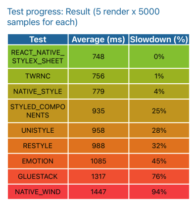

# react-native-stylex-sheet

React Native 向け 軽量・高速な CSS-in-JS ライブラリです。React Native標準のStyleSheetのcss指定に対しての下位互換性を保持しつつ、React Nativeで標準でサポートされていないthemeやvariantsなどの拡張を含んでいます。WEBの[stylexjs](https://stylexjs.com/docs/learn/recipes/variants/)と可能な限り互換性のあるインターフェースを保ち、これを用いたクロスプラットフォーム化を簡易化することを目的にしています。ReactNativeおよび、Reactのみをpeer dependenciesとしているため、このライブラリを利用して作成されたコンポーネントは、ネイティブアプリのAPIやデバイスに依存するコードを含めない限り、react-native-webでもそのまま動かすことが出来ます。

## ベンチマーク

[ベンチマークテスト用レポジトリ](https://github.com/tkow/react-native-stylesheet-benchmark)



## インストール

```sh
npm install @mochi-inc-japan/react-native-stylex-sheet
```

## クイックスタート

### シンプルな使い方（テーマ / バリアント / メディアなし）

テーマ・バリアント・レスポンシブメディアクエリが不要な場合は、名前空間インポートを使います。

```tsx
import * as stylex from '@mochi-inc-japan/react-native-stylex-sheet';

const styles = stylex.create({
  button: {
    padding: 16,
    borderRadius: 8,
    backgroundColor: '#6200ee',
  },
});

function Button() {
  return (
    <Pressable {...stylex.props(styles.button)}>
      <Text>押してください</Text>
    </Pressable>
  );
}
```

ダイナミックスタイルを利用したい場合は、props関数に直接styleオブジェクトを指定します。

```tsx
import * as stylex from '@mochi-inc-japan/react-native-stylex-sheet';

const styles = stylex.create({
  button: {
    padding: 16,
    borderRadius: 8,
    backgroundColor: '#6200ee',
  },
});

function Button({ width }) {
  return (
    <Pressable {...stylex.props(styles.button, { width })}>
      <Text>押してください</Text>
    </Pressable>
  );
}
```

### 高度な使い方（テーマ / バリアント / メディア）

テーマ・バリアント・レスポンシブブレークポイントを使う場合は、アプリを `RNStyleXProvider` でラップし、コンポーネント内で `const stylex = useStylex()` を使います。

```tsx
import {
  create,
  createVariants,
  createThemes,
  defineConsts,
  useStylex,
  RNStyleXProvider,
} from '@mochi-inc-japan/react-native-stylex-sheet';
import type { Variants } from '@mochi-inc-japan/react-native-stylex-sheet';

// 1. メディアブレークポイントを定数として定義
const media = defineConsts({
  md: '(width >= 750px)',
  lg: '(width >= 1080px)',
});

// 2. テーマを定義
const { themes } = createThemes(['light', 'dark']);

// 3. バリアントグループを定義（任意）
const buttonVariants = createVariants({
  color: {
    backgroundColor: {
      default: '#6200ee',
      danger: '#b00020',
    },
  },
});

// 4. モジュールレベルでスタイルを定義
const styles = create({
  button: {
    ...buttonVariants.color,
    padding: {
      default: 12,
      [media.md]: 16,
    },
    borderRadius: 8,
  },
});

// 5. アプリを RNStyleXProvider でラップ
function App() {
  const [dark, setDark] = useState(false);
  return (
    <RNStyleXProvider theme={dark ? themes.dark : undefined}>
      <Screen />
    </RNStyleXProvider>
  );
}

// 6. コンポーネント内で const stylex = useStylex() を使用
// — RNStyleXProvider のテーマとメディアは mix() で自動的に適用される
function Button({ danger }: { danger?: boolean }) {
  const stylex = useStylex();
  return (
    <Pressable
      {...stylex.props(
        stylex.mix<Variants<typeof buttonVariants>>(styles.button, { color: danger ? 'danger' : 'default' })
      )}
    >
      <Text>押してください</Text>
    </Pressable>
  );
}
```

useStylex()及び、RNStyleXProviderを用いた場合、Providerにセットしたテーマとメディアは自動的に適用されるため、`mix()` はvariantsを指定しない場合は省略可能です。省略せずに明示的にwidthやthemeをその場で指定して書き換えることも可能です。また、ライブラリからexportされているmix関数は省略できないため、テーマ・バリアント・メディアを利用する必要があるコンポーネントについては、標準のmix関数ではなくuseStylex由来のmix関数を利用することを推奨します。

```tsx

// const stylex = useStylex();
// または
// import * as stylex from '@mochi-inc-japan/react-native-stylex-sheet'
stylex.mix<Variants<typeof buttonVariants>>(
  [
    styles.button,
    {
      media: stylex.windowWidth,
      theme: themes.dark
    }
  ],
  { color: danger ? 'danger' : 'default' }
);
```

---

## 既存のReact Nativeコンポーネントからの移行

`stylex.create`は拡張記法を利用しない限り、react-native標準の`StyleSheet.create`に対して下位互換性を保持しているので、`StyleSheet.create`で定義されているReact Nativeのstyleをそのまま再利用することが出来ます。そのため全てのコンポーネントを一括で変更する必要はなく、部分的に置き換えていくことが可能です。

```tsx
// 移行前
import { StyleSheet } from 'react-native';

const styles = StyleSheet.create({
  button: {
    padding: 16,
    borderRadius: 8,
    backgroundColor: '#6200ee',
  },
});

function Button() {
  return (
    <Pressable >
      <Text>押してください</Text>
    </Pressable>
  );
}

// 移行後
import * as stylex from '@mochi-inc-japan/react-native-stylex-sheet';

const styles = stylex.create({
  button: {
    padding: 16,
    borderRadius: 8,
    backgroundColor: '#6200ee',
  },
});

function Button() {
  return (
    <Pressable {...stylex.props(styles.button)}>
      <Text>押してください</Text>
    </Pressable>
  );
}
```

## セットアップパターン

共有定数（メディアブレークポイントとテーマ）は単一ファイルに定義してエクスポートするパターンを推奨します。

```ts
// src/styles/stylex.ts
import {
  createThemes,
  defineConsts,
} from '@mochi-inc-japan/react-native-stylex-sheet';

export const media = defineConsts({
  md: '(width >= 750px)',
  lg: '(width >= 1080px)',
});

export const fontSize = defineConsts({
  default: 16,
  md: 24,
  lg: 32
});

export const { themes } = createThemes(['light', 'dark']);
```

---

## API リファレンス

### `defineConsts(consts)`

渡されたオブジェクトのフリーズコピーを返します。メディアクエリ文字列などのモジュールレベル定数に使用します。

```ts
const media = defineConsts({
  md: '(width >= 750px)',
  lg: '(width >= 1080px)',
});
```

### `defineVars(defaults)`

`defineConsts` のエイリアスです。フリーズコピーを返します。スタイルプロパティオブジェクトとして参照されるデフォルト値の定義に便利です。

```ts
const colors = defineVars({
  default: 'white',
  primary: 'red',
  secondary: 'blue',
});

const styles = create({
  box: { backgroundColor: colors }, // デフォルトは 'white'
});
```

---

### `create(styleDefs)`

モジュールレベルでスタイルを定義します。各プロパティ値にはプレーンな React Native 値か、バリアントキーと値のマップオブジェクトを指定できます。コンパイル済みスタイルエントリのマップを返します。

```ts
const styles = create({
  container: {
    backgroundColor: {
      default: '#fff',
      [media.md]: '#f0f0f0',
      [themes.dark]: '#111',
    },
    padding: 16,
  },
  title: {
    fontSize: 24,
    fontWeight: '700',
  },
});
```

---

### `createVariants(variantDefs)`

名前付きバリアントグループを定義します。各グループは CSS プロパティ名を `default` および名前付きバリアント値のオブジェクトにマッピングします。`create()` にスプレッドできる処理済みバリアントオブジェクトを返します。

```ts
const buttonVariants = createVariants({
  // バリアントグループ名: 'color'
  color: {
    backgroundColor: {
      default: '#6200ee',
      primary: '#6200ee',
      danger:  '#b00020',
    },
    borderColor: {
      default: 'transparent',
      danger:  '#b00020',
    },
  },
  size: {
    height: {
      default: 40,
      sm: 32,
      lg: 48,
    },
  },
});

const styles = create({
  button: {
    ...buttonVariants.color, // カラーバリアントプロパティをスプレッド
    ...buttonVariants.size,
    borderRadius: 8,
  },
});
```

バリアント指定時に `Variants` 型ヘルパーを使用して、mix関数の引数として受け入れ可能な値を型推論できます。

```ts
import type { Variants } from '@mochi-inc-japan/react-native-stylex-sheet';

type ButtonVariants = Variants<typeof buttonVariants>;
// { color: 'primary' | 'danger' | 'default'; size: 'sm' | 'lg' | 'default' }

 stylex.mix<Variants<ButtonVariants>>(styles.button, { color, size })
```

---

### `createThemes(themeNames)`

`RNStyleXProvider` にキーを渡してテーマをアクティブにします。

```tsx
<RNStyleXProvider theme={themes.dark}>
  <App />
</RNStyleXProvider>
```

名前付きテーマキーを作成します。`{ themes }` を返し、各名前は `create()` でスタイルプロパティキーとして使用される不透明なキー文字列にマッピングされます。

```tsx
import * as stylex from '@mochi-inc-japan/react-native-stylex-sheet'
import { useStylex } from '@mochi-inc-japan/react-native-stylex-sheet'

const { themes } = stylex.createThemes(['light', 'dark']);

const styles = stylex.create({
  text: {
    color: {
      default: '#000',
      [themes.light]: '#000',
      [themes.dark]:  '#fff',
    },
  },
});

function App () {
  const stylex = useStylex()
  return (
    <Text
      {...stylex.props(styles.text)}
    >
      Hello World!
    </Text>
  )
}
```

themeによってスタイルを追加したいケースや異なるvariableを設定したいケースなどでは、`stylex.create`または`createThemes().defineThemes`、および、`style.props`を使って選択中のthemeに対応するstyleによって、デフォルトのスタイルをオーバーライト出来ます。

```tsx
import { View, Text } from 'react-native'
import * as stylex from '@mochi-inc-japan/react-native-stylex-sheet'
import { useStylex } from '@mochi-inc-japan/react-native-stylex-sheet'

const { themes, defineThemes, themeStyleSheets } = stylex.createThemes(['light', 'dark', 'other']);

// defaultのスタイル定義
const defaultColors = stylex.defineVars({
  primary: 'black',
  danger: 'red',
})

const variables = stylex.createVariants({
  text: {
    color: defaultColors
  }
});

const styles = stylex.create({
  view: {
    width: '100%',
    height: '100%'
  },
  text: {
    ...variables.text
  },
});

// 新たなThemeのvariantsスタイル定義
const darkThemeStyleVariants = stylex.createVariants({
  text: { color: { ...defaultColors, 'primary': 'white' }, },
})

const otherThemeStyleVariants = stylex.createVariants({
  text: { color: { ...defaultColors, 'primary': 'blue' }, },
})

const viewTheme = stylex.create({
  // 追加のスタイルはcreateに直接記入する
  [themes.dark]: { backgroundColor: 'black' }
  [themes.other]: { backgroundColor: 'gray'}
})

// NOTE: defineThemesは単なるcreateのaliasですが、未定義のtheme指定に対して型チェックが機能します。
const textTheme = defineThemes({
  // 追加のスタイルはcreateに直接記入する
  [themes.dark]: { borderColor: 'white', borderWidth: 1, ...darkThemeStyleVariants.text}
  [themes.other]: {...otherThemeStyleVariants.text}
})

// NOTE: themeStyleSheetsはパフォーマンスを上げたりstyle propertyに直接指styleを指定できるstyle sheetのobjectを取得できます。
const touchableTheme= themeStyleSheets({
  [themes.dark]: { color: 'red'}
  [themes.other]: { color: 'blue'}
});

function App () {
  const stylex = useStylex()
  return (
    <View {...stylex.props(styles.view, viewTheme[stylex.theme])}>
      <TouchableOpacity style={touchableTheme[themes.theme]}>
        <Text
          /* */
          {...stylex.props(styles.text, stylex.mix(textTheme[stylex.theme], { text: 'primary' }))}
        >
          Hello World!
        </Text>
      </TouchableOpacity>
    </View>
  )
}
```

---

### `RNStyleXProvider`

`useStylex()` 実行時に `theme` とmediaの判定基準となる `windowWidth` を供給するプロバイダーコンポーネントです。widthは指定しなければ、Provider内で暗黙的に`PixelRatio.getPixelSizeForLayoutSize(useWindowDimensions().width)`を利用します。

```tsx
<RNStyleXProvider theme={themes.dark}>
  <Screen />
</RNStyleXProvider>
```

Props:
- `theme` — `createThemes()` のテーマキー文字列、またはアクティブテーマなしの場合は省略
- `windowWidth` — デバイス幅の上書き（デフォルト: `PixelRatio.getPixelSizeForLayoutSize(useWindowDimensions().width)`）

---

### `useStylex()`

`{ props, mix, windowWidth, theme }` を返すフックです。`RNStyleXProvider` の内部で使用する必要があります。`mix` はコンテキストからアクティブなテーマと画面幅を自動的に適用します。variantsを指定しない場合は省略可能です。明示的にwidthやthemeをその場で指定することも可能です。

```tsx
import * as stylex from '@mochi-inc-japan/react-native-stylex-sheet'

const { themes } = stylex.createThemes(['light', 'dark']);
const colors = stylex.defineVars({
  default: '#6200ee',
  primary: '#6200ee',
  danger:  '#b00020',
})
const cardVariants = stylex.createVariants({
  // バリアントグループ名: 'color'
  bgcolor: {
    backgroundColor: colors,
  }
})
const styles = stylex.create({
  card: {
    ...cardVariants
  },
  title: {
    color: {
      [themes.light]: 'black'
      [themes.dark]: 'white'
    },
    padding: {
      default: 12,
      [media.md]: 16,
    },
    borderRadius: 8,
  },
})

function Card({ bgcolor }: { bgcolor: keyof typeof colors }) {
  const stylex = useStylex();
  return (
    <View {...stylex.props(
      stylex.mix<Variants<typeof cardVariants>>(styles.card, { bgcolor })
    )}>
      {/* stylex.mixを実行しなくてもstyles.titleのthemeとmediaのstyleが適用される */}
      <Text {...stylex.props(styles.title)}>Hello</Text>
    </View>
  );
}

render(
  <stylex.RNStylexProvider theme={themes.dark}>
    <Card bgcolor='primary'>
  </stylex.RNStylexProvider>
)

```

---

### `mix(target, variantArgs?)`

コンパイル済みスタイルエントリを `RNStyle` オブジェクトの配列に解決します。

1. 常に `default` スタイルを含めます。
2. `variantArgs` が指定された場合、一致するバリアントスタイルを追加します。
3. `useStylex().mix()` 経由で呼び出した場合、アクティブなテーマとメディアクエリスタイルも自動的に適用します。

```ts
// モジュールレベル（非リアクティブ）— デフォルトスタイルのみ
const style = mix(styles.button);

// 明示的なバリアント指定
const style = mix(styles.button, { color: 'danger', size: 'lg' });

// コンポーネント内 — RNStyleXProvider のテーマ・メディアは自動的に適用される
const stylex = useStylex();
const style = stylex.mix(styles.button, { color: 'danger' });

const media = defineConsts({
  md: '(width >= 750px)',
  lg: '(width >= 1080px)',
});

const style = stylex.mix(
  [
    styles.button,
    {
      media: (media.md(強制的なmediaクエリマッチ) or 750(任意のwidthで判定)),
      theme: themes.dark(強制的にtheme keyの指定が可能)
    }
  ],
  { color: 'danger' }
);
```

---

### `props(...args)`

スタイル配列を React Native コンポーネントにスプレッドするための `{ style: [...] }` を返します。`RNStyle[]` 配列またはプレーンなスタイルオブジェクトを受け取ります。

```tsx
// 複数の mix() 結果を結合
function Component() {
  const stylex = useStylex();
  return <View {...stylex.props(stylex.mix(styles.base), stylex.mix(styles.override))} />;
}

// モジュールレベル（非リアクティブ、デフォルトスタイルのみ）— import * as stylex
<View {...stylex.props(styles.container)} />
```

---

### `flatten(...args)`

`props()` と同じシグネチャでスタイル配列を受け取り、`StyleSheet.flatten()` を通じて単一の `RNStyle` オブジェクトを返します。`TouchableOpacity` の `style` や `ScrollView` の `contentContainerStyle` など、配列形式のスタイルを受け付けないコンポーネントに使用します。

```tsx
// モジュールレベル（非リアクティブ、デフォルトスタイルのみ）
<TouchableOpacity style={stylex.flatten(styles.button)} />

// コンポーネント内 — RNStyleXProvider のテーマ・メディアが自動適用される
const stylex = useStylex();
<TouchableOpacity
  style={stylex.flatten(stylex.mix(styles.button, { color: 'danger' }))}
/>

// 複数エントリを一つのオブジェクトにマージ
<ScrollView
  contentContainerStyle={stylex.flatten(styles.container, styles.padding)}
/>
```

---

## メディアクエリ

メディアクエリ文字列はスタイルプロパティキーとして直接使用します。文字列はサポートされている範囲形式のいずれかに一致する必要があります。

| 形式 | 例 |
|---|---|
| 下限 | `(width >= 750px)` / `(width > 750px)` |
| 上限 | `(width <= 1080px)` / `(width < 1080px)` |
| 範囲 | `(750px <= width < 1080px)` |

**キーの順序が重要です。** 後から一致したキーが前のキーを上書きするため、より具体的なクエリは後に記述してください。

```ts
const media = defineConsts({
  md: '(width >= 750px)',
  lg: '(width >= 1080px)', // より具体的 — 後に記述
});

const styles = create({
  text: {
    fontSize: {
      default: 16,
      [media.md]: 18,
      [media.lg]: 20, // lg も一致する場合は md より優先される
    },
  },
});
```


---

## 制限事項

`TouchableOpacity` のようにスタイルに配列を受け付けないコンポーネントや、`ScrollView` の `contentContainerStyle` のような特殊なスタイルキーを持つコンポーネントに遭遇することがあります。
その場合、以下の2つの解決策があります。

1. テーマ・メディアクエリ・バリアントを使わないスタイルの場合は、`stylex.create` の結果プロパティの `"default"` キーを使います。この値はいかなるオーバーライドも適用されていない `RNStyle` オブジェクトです。

```tsx
const styles = stylex.create({
  scroll: {
    width: 100,
  },
});

<ScrollView contentContainerStyle={styles.scroll.default} />;
```

2. デフォルトスタイルにバリアント・テーマ・メディアを適用した結果を1つのオブジェクトにマージしたい場合は、`stylex.flatten()` と `stylex.mix()` を組み合わせます。

```tsx
const variants = createVariants({
  h: {
    height: {
      default: 100,
      lg: 200,
    },
  },
});

const styles = stylex.create({
  touch: {
    width: 100,
    ...variants.h,
  },
});

const stylex = useStylex();
<TouchableOpacity style={stylex.flatten(stylex.mix(styles.touch, { h: 'lg' }))} />;
```

React Native には CSS カスケード、継承、キーフレーム、疑似要素、グローバルスタイルがありません。これらの機能は設計上サポートされていません。

| 非対応 | 代替手段 |
|---|---|
| CSS 変数 | 共有値には `defineVars()` / `defineConsts()` を使用 |
| `shadows` トークンスケール | iOS/Android のシャドウ API は互換性がないため、シャドウスタイルは直接定義する |
| `transitions` | [Animated API](https://reactnative.dev/docs/animated) または [react-native-reanimated](https://github.com/software-mansion/react-native-reanimated) を使用 |
| グローバルスタイル | React Native では該当なし |
| 疑似クラス / 疑似要素 | React Native では該当なし |
